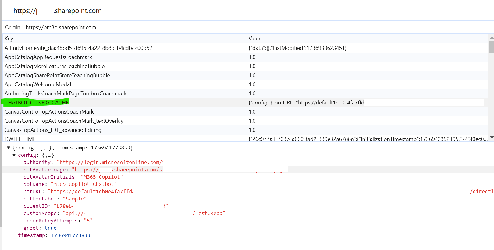
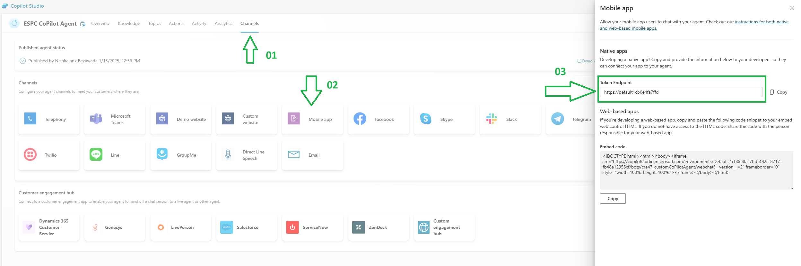

# Copilot Chat Bubble - jd123x v4

## Summary

This web part integrates the Microsoft Copilot Agent, built via Copilot Studio, into SharePoint Online featuring Single Sign-on and a chat interface.  

For sample purpose, I have built a CoPilot agent which will summarize sessions at ESPC 2024, and Provides a concise summary of all sessions and topics covered at ESPC 2024, including key take aways and speakers insights.

The webpart uses Cache management to store the webpart properties, which is fetched from the list. 

### Webpart properties

This webpart reads the configuration from a configuration list as CopilotAgentConfig.
- Create the "CopilotAgentConfig" list with below columns

|Property Name|Column type|Explanation|Mandatory?|
| :- | :- | :- | :- |
|BotName|Single line of text|Name of the Bot|No|
|BotURL|Single line of text|The token endpoint for MCS. This can be found in the CoPilot studio, under Settings -> Channels -> Mobile App (Screenshot below)|Yes|
|BotAvatarImage|Single line of text|Direct link for the avatar image|No|
|BotAvatarInitials|Single line of text|bot initials used when no image present|No|
|Greet|Yes/No|Should the copilot greet users at the beginning of the conversation|No|
|CustomScope|Single line of text|
The scope defined for the custom API in the copilot app registration (Step 1). For example:

api://35337616-eee1-4049-9d37-a78b24c3bef2/SPO.Read
|Yes|
|ClientID|Single line of text|The Application ID from the Canvas app registration configured in step 2|Yes|
|Authority|Single line of text|
The login URL for your tenant. For example: https://login.microsoftonline.com/mytenant.onmicrosoft.com|Yes|
|ErrorRetryAttempts|Single line of text|Number of retry attempts made to get the properties from the List|Yes|No|

## Compatibility

| :warning: Important          |
|:---------------------------|
| Every SPFx version is optimally compatible with specific versions of Node.js. In order to be able to build this sample, you need to ensure that the version of Node on your workstation matches one of the versions listed in this section. This sample will not work on a different version of Node.|
|Refer to <https://aka.ms/spfx-matrix> for more information on SPFx compatibility.   |

This sample is optimally compatible with the following environment configuration:

-Incompatible-red.svg "SharePoint Server 2016 Feature Pack 2 requires SPFx 1.1")

## Applies to

- [SharePoint Framework](https://aka.ms/spfx)
- [Microsoft 365 tenant](https://docs.microsoft.com/en-us/sharepoint/dev/spfx/set-up-your-developer-tenant)

> Get your own free development tenant by subscribing to [Microsoft 365 developer program](http://aka.ms/o365devprogram)

## Contributors

- [Nishkalank Bezawada](https://github.com/NishkalankBezawada)

## Version history

| Version | Date             | Comments        |
| ------- | ---------------- | --------------- |
| 1.0     | January 10, 2025 | Initial release |

## Minimal path to awesome

For details setup instructions, please refer to the [Setup.md](Setup.md) file.

## Features

This sample illustrates the following concepts:

- Microsoft CoPilot Integration
- Chat Interface
- Single Sign-On (SSO)
- Customizable according to organizational needs
- Secure

## References

- [Copilot Studio - Building SharePoint SSO Component](https://github.com/microsoft/CopilotStudioSamples/tree/master/SharePointSSOComponent?wt.mc_id=MVP_331342) 

## Help

We do not support samples, but this community is always willing to help, and we want to improve these samples. We use GitHub to track issues, which makes it easy for  community members to volunteer their time and help resolve issues.

If you're having issues building the solution, please run [spfx doctor](https://pnp.github.io/cli-microsoft365/cmd/spfx/spfx-doctor/) from within the solution folder to diagnose incompatibility issues with your environment.

You can try looking at [issues related to this sample](https://github.com/pnp/sp-dev-fx-webparts/issues?q=label%3A%22sample%3A%20react-copilot-chatbubble-with-sso%22) to see if anybody else is having the same issues.

You can also try looking at [discussions related to this sample](https://github.com/pnp/sp-dev-fx-webparts/discussions?discussions_q=react-copilot-chatbubble-with-sso) and see what the community is saying.

If you encounter any issues using this sample, [create a new issue](https://github.com/pnp/sp-dev-fx-webparts/issues/new?assignees=&labels=Needs%3A+Triage+%3Amag%3A%2Ctype%3Abug-suspected%2Csample%3A%20react-copilot-chatbubble-with-sso&template=bug-report.yml&sample=react-copilot-chatbubble-with-sso&authors=@NishkalankBezawada&title=react-copilot-chatbubble-with-sso%20-%20).

For questions regarding this sample, [create a new question](https://github.com/pnp/sp-dev-fx-webparts/issues/new?assignees=&labels=Needs%3A+Triage+%3Amag%3A%2Ctype%3Aquestion%2Csample%3A%20react-copilot-chatbubble-with-sso&template=question.yml&sample=react-copilot-chatbubble-with-sso&authors=@NishkalankBezawada&title=react-copilot-chatbubble-with-sso%20-%20).

Finally, if you have an idea for improvement, [make a suggestion](https://github.com/pnp/sp-dev-fx-webparts/issues/new?assignees=&labels=Needs%3A+Triage+%3Amag%3A%2Ctype%3Aenhancement%2Csample%3A%20react-copilot-chatbubble-with-sso&template=suggestion.yml&sample=react-copilot-chatbubble-with-sso&authors=@NishkalankBezawada&title=react-copilot-chatbubble-with-sso%20-%20).

## Disclaimer

**THIS CODE IS PROVIDED *AS IS* WITHOUT WARRANTY OF ANY KIND, EITHER EXPRESS OR IMPLIED, INCLUDING ANY IMPLIED WARRANTIES OF FITNESS FOR A PARTICULAR PURPOSE, MERCHANTABILITY, OR NON-INFRINGEMENT.**

